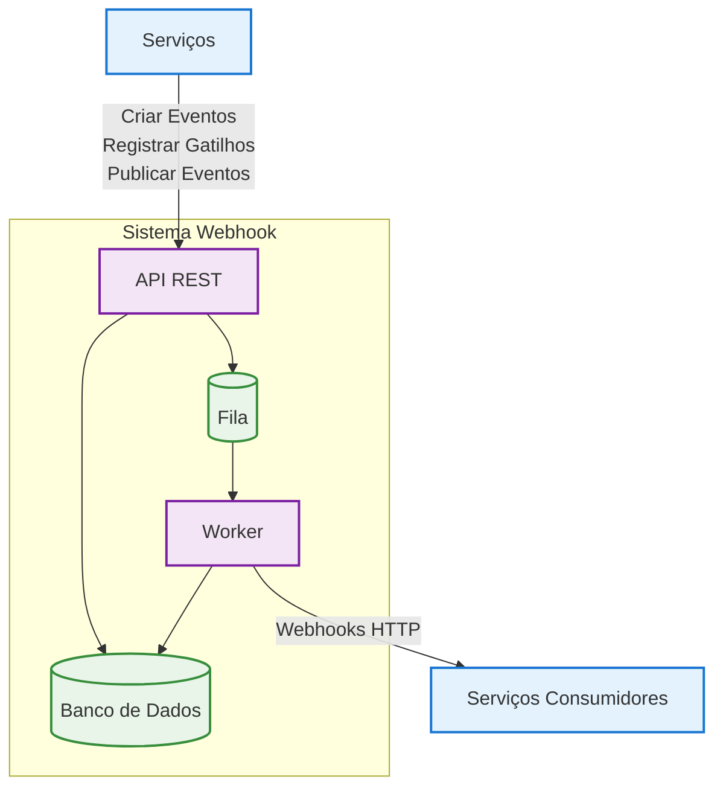

# Documentação IWebhook 

## Introdução

Este sistema de webhook é uma aplicação desenvolvida em Go que permite a comunicação entre serviços internos através de eventos. O projeto implementa uma arquitetura orientada a eventos (Event-Driven Architecture) que possibilita o registro, disparo e processamento de eventos entre diferentes serviços.

### Objetivos

#### Simplicidade de implementação
- Webhooks funcionam basicamente como requisições HTTP entre sistemas.
- Não é necessário configurar brokers, tópicos ou clusters como no Kafka.
- Ideal para integrações rápidas e simples entre dois ou poucos sistemas.

####  Baixo custo operacional
- Não há necessidade de infraestrutura complexa.
- Evita custos e esforço com manutenção, escalabilidade e monitoramento de um cluster Kafka.

#### Comunicação direta e instantânea
- O serviço produtor envia imediatamente a requisição HTTP para o consumidor.
- Ideal para eventos que precisam ser processados em tempo real, com baixa latência.

#### Baseado em padrões amplamente suportados
- HTTP, REST e JSON são padrões conhecidos e amplamente suportados por praticamente todas as linguagens e frameworks.
- Evita a necessidade de bibliotecas específicas de cliente Kafka.

#### Facilidade de depuração e monitoramento
- Como se trata de chamadas HTTP, é fácil capturar logs, usar ferramentas como Postman, cURL ou proxies (ex.: ngrok) para testar.
- Não requer ferramentas especializadas para inspeção como Kafka precisa (ex.: Kafka Tool, KSQL, etc).

#### Desacoplamento via endpoints
- Cada sistema apenas precisa expor ou consumir um endpoint HTTP, sem necessidade de se preocupar com filas, partições ou consumers groups.
#### Menos dependência de stack tecnológica
- Webhooks podem ser implementados mesmo em sistemas legados ou monolíticos que não possuem capacidade ou necessidade de adoção de Kafka.

---

## Arquitetura do Sistema

### Visão Geral da Arquitetura

<!-- **Tipos de Gatilho:**
- **fireForGet**: Dispara e não espera resposta
- **persistent**: Mantém persistente até sucesso
- **notPersistent**: Envia uma única vez -->

----

## Recomendações de Segurança

### ⚠️ Comunicação em Rede Privada

**IMPORTANTE**: Para garantir a segurança da comunicação entre serviços, é **altamente recomendado** que:

- **Todos os serviços que utilizam o sistema de webhook sejam executados em uma rede privada/interna**
- **Os endpoints de webhook NÃO devem ser expostos publicamente na internet**
- **Utilize redes privadas virtuais (VPN) ou redes internas (como Docker networks, Kubernetes clusters internos)**

### Práticas Recomendadas

1. **Isolamento de Rede**: Configure firewalls e grupos de segurança para permitir comunicação apenas entre serviços autorizados
2. **Autenticação**: Implemente mecanismos de autenticação entre serviços (tokens, certificados, etc.)
3. **Criptografia**: Use HTTPS/TLS para comunicação entre serviços, mesmo em redes internas
4. **Monitoramento**: Implemente logs de auditoria para rastrear todas as comunicações webhook
5. **Rate Limiting**: Configure limites de taxa para prevenir abuso dos endpoints

---