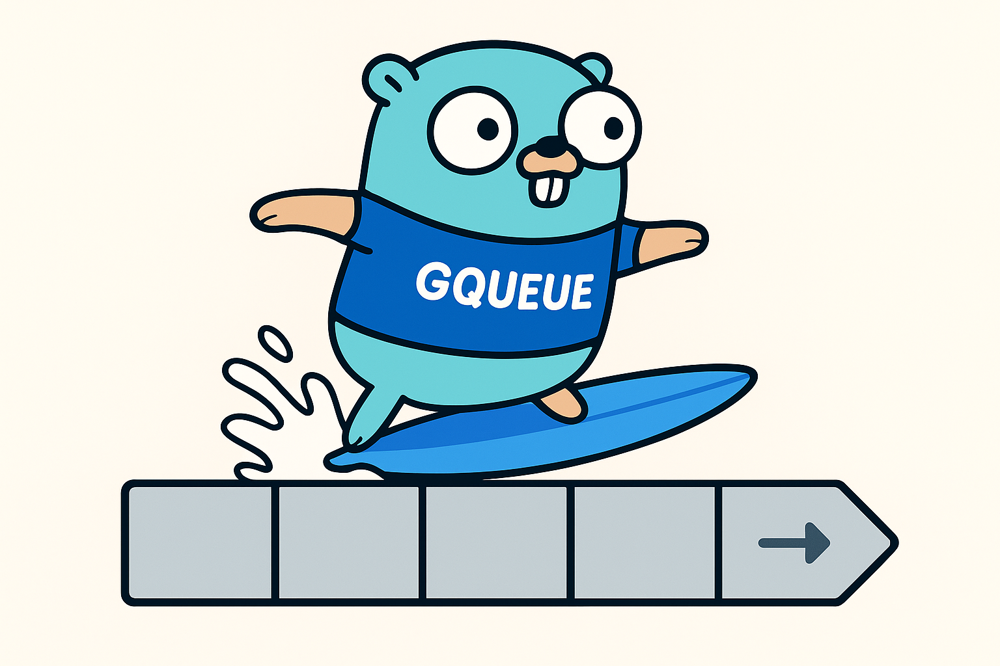
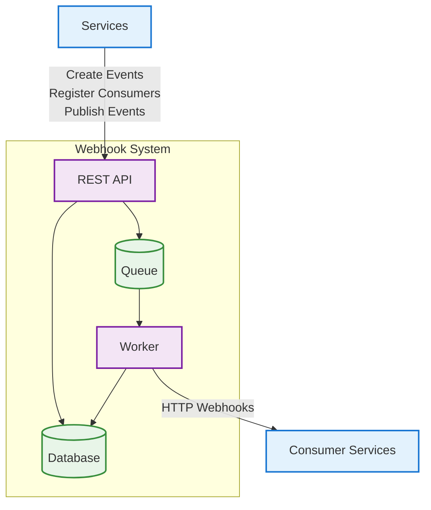

# Gqueue Documentation



## Introduction

Gqueue positions itself as a solution that abstracts the complexity of asynchronous communication, allowing companies to focus on their core business while maintaining a flexible, scalable, and governable architecture. The proposal is to offer **agility** and **governance** for teams and companies through an intelligent abstraction that solves real implementation and operation problems.

### Objectives

#### 1. Abstraction and Decoupling

**Current Problem**

- Direct use of queue tools requires complete configuration and specific setup for each application
- Tool changes require reconfiguration and new setup
- Strong coupling with specific technologies

**Gqueue Solution**

- **Simplified abstraction**: Intermediate layer that reduces implementation complexity
- **Tool flexibility**: Ability to switch different queues without reconfiguring the service
- **Single configuration**: Only configurations are needed, no complex setup in the service

#### 2. Cost and Time Optimization

**Problematic Scenario**
An urgent delivery arises with small async flow. The options are:

- Configure a complete queue setup (more time)
- Use existing robust and expensive tool for something simple

**Gqueue Benefits**

- **Reduced implementation time**: Simple configurations replace complex setups
- **Smart tool selection**: Use the right tool for each scenario
- **Resource savings**: Avoid over-engineering and unnecessary costs

#### 3. Enterprise Governance and Scalability

**Current Architectural Problems**

- Centralized tool for all teams can create single point of failure
- Small applications need to follow unnecessary robust configurations
- Distributed responsibilities without clear owners

**Architecture Proposed by Gqueue**

- **Distributed responsibilities**: Each application has its own broker
- **Separate monitoring**: Costs and responsibilities clearly divided by teams
- **Adequate configurations**: Each scenario can have the necessary configuration
- **Managed communication**: Services from different teams communicate simply

#### 4. Built-in Advanced Features

**Order Guarantee**
**Problem**: Need for queue with order guarantee

- Enterprise messaging tools can be "using a bazooka to kill an ant" (expensive and laborious)
- Creating internal pattern is costly in time and development

**Gqueue Solution**:

- Order guarantee with ease
- Switch robustness in ordered events with just one field in the payload
- Use internal service as needed

**Message Scheduling**
**Problem**: Publish scheduled messages for future delivery

- Integration with specific tools for each service
- Laborious and specific configurations

**Gqueue Solution**:

- Simple scheduling with just one item in the payload
- No need for additional integrations

#### 5. Operational Simplification

**Core Business Focus**

- **Business objective**: Companies should focus on product and value delivery
- **Complexity abstraction**: Gqueue handles communication complexity
- **Simplified governance**: Teams can concentrate on their main responsibilities

**Operational Benefits**

- **Clear separation of responsibilities**: Each team takes care of its internal services
- **Reduction of laborious configurations**: Simplified setup
- **Team agility**: Fast implementation and efficient governance

#### 6. Specific Use Cases

**For Medium and Large Companies**

- **Distributed scenario**: Each application with its broker
- **Separate monitoring**: Costs divided by teams
- **Flexible configurations**: Adaptation according to specific needs

**For Different Types of Applications**

- **Critical applications**: Robust configurations when necessary
- **Simple applications**: Lightweight configurations without over-engineering
- **Legacy applications**: Integration without major architectural changes

---

## System Architecture

### Architecture Overview



---

## Installation and Usage

### 🐳 Running with Docker

#### Quick Start (Recommended)

1. Clone the repository:

```bash
git clone https://github.com/IsaacDSC/gqueue.git
cd gqueue
```

2. Choose your deployment profile:

**Complete Application (App + Database + Cache):**

```bash
docker-compose -f deployment/app-pgsql/docker-compose.yaml --profile complete up -d
```

**Infrastructure Only (Database + Cache + PubSub):**

```bash
docker-compose -f deployment/app-pgsql/docker-compose.yaml --profile infra up -d
```

**With Example Consumer:**

```bash
docker-compose -f deployment/app-pgsql/docker-compose.yaml --profile complete --profile example up -d
```

**With Monitoring (Grafana):**

```bash
docker-compose -f deployment/app-pgsql/docker-compose.yaml --profile complete --profile observability up -d
```

**With Debug Tools (PgAdmin):**

```bash
docker-compose -f deployment/app-pgsql/docker-compose.yaml --profile complete --profile debug up -d
```

3. Access the application at `http://localhost:8080`

#### Docker Profiles Explained

- **`complete`** - Full application with server, PostgreSQL, Redis, and PubSub emulator
- **`infra`** - Only infrastructure services (PostgreSQL, Redis, PubSub) for local development
- **`example`** - Adds example consumer service
- **`observability`** - Adds Grafana for monitoring at `http://localhost:3000`
- **`debug`** - Adds PgAdmin for database management at `http://localhost:8081`

#### Useful Commands

```bash
# Stop all services
docker-compose -f deployment/app-pgsql/docker-compose.yaml down

# View logs
docker-compose -f deployment/app-pgsql/docker-compose.yaml logs -f

# Rebuild and restart
docker-compose -f deployment/app-pgsql/docker-compose.yaml --profile complete up -d --build
```

#### Service URLs

- **Main Application**: `http://localhost:8080`
- **PgAdmin** (debug profile): `http://localhost:8081` (admin@admin.com / admin)
- **Grafana** (observability profile): `http://localhost:3000` (admin / admin123)
- **Example Consumer** (example profile): `http://localhost:3333`

---

## System Features

### Event Types and Triggers

The webhook system supports various event types and trigger mechanisms:

- **User Events**: Registration, authentication, profile updates
- **Transaction Events**: Payment processing, order completion
- **System Events**: Health checks, monitoring alerts
- **Custom Events**: Configurable business logic events

---

## Security Recommendations

### ⚠️ Private Network Communication

**IMPORTANT**: To ensure secure communication between services, it is **highly recommended** that:

- **All services using the webhook system are executed in a private/internal network**
- **Webhook endpoints should NOT be exposed publicly on the internet**
- **Use virtual private networks (VPN) or internal networks (such as Docker networks, internal Kubernetes clusters)**

### Recommended Practices

1. **Network Isolation**: Configure firewalls and security groups to allow communication only between authorized services
2. **Authentication**: Implement authentication mechanisms between services (tokens, certificates, etc.)
3. **Encryption**: Use HTTPS/TLS for communication between services, even on internal networks
4. **Monitoring**: Implement audit logs to track all webhook communications
5. **Rate Limiting**: Configure rate limits to prevent endpoint abuse

---

## API Reference

The system provides a REST API for webhook management and event processing. For detailed API documentation and examples, refer to the `client.http` file in the project root.

## Contributing

Please read [CONTRIBUTING.md](CONTRIBUTING.md) for details on our code of conduct and the process for submitting pull requests.

## License

This project is licensed under the terms specified in the [LICENSE](LICENSE) file.
